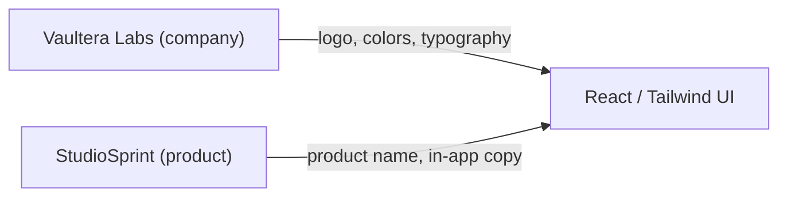

# Vaultera Labs Frontend Brand Guidelines Document

## Deliverable

A single markdown file at [`docs/BRAND_GUIDELINES.md`](docs/BRAND_GUIDELINES.md) that serves as the authoritative reference for the frontend rebrand. It will translate the attached brand guideline image into actionable rules for this Laravel + Inertia + React + Tailwind codebase.

**Naming model (confirmed):** Vaultera Labs = company; StudioSprint = product name in-app.

---

## Document Structure

The markdown file will follow the same sections as the brand guideline image, then extend each section with frontend-specific implementation notes for this repo.

### 1. Header & Purpose

- Title: **Vaultera Labs — Brand Identity & Frontend Guidelines**
- Scope: StudioSprint frontend (`resources/js/`, `resources/css/`, `tailwind.config.js`)
- Relationship diagram:



---

### 2. Logo System

Document the three logo variations from the guidelines:

| Variation | Description | Frontend usage |
|-----------|-------------|----------------|
| **Symbol** | Blue hexagon + white lock/path mark | Favicon, sidebar collapsed state, mobile header, loading states |
| **Vertical** | Symbol stacked above "Vaultera Labs" | Auth pages ([`GuestLayout.jsx`](resources/js/Layouts/GuestLayout.jsx)), onboarding splash |
| **Horizontal** | Symbol left of "Vaultera Labs" | Top nav ([`AuthenticatedLayout.jsx`](resources/js/Layouts/AuthenticatedLayout.jsx)), marketing footer |

**Logo rules to include:**
- Minimum clear space around the mark (1× symbol height on all sides)
- Do not recolor the hexagon outside `#007CFF` tints
- Do not stretch, rotate, or add effects to the mark
- On dark backgrounds: use full-color symbol; on light backgrounds: same (blue hex is self-contained)
- **StudioSprint wordmark** remains for in-app product context (sidebar, page titles); Vaultera Labs logo appears in company contexts (auth shell footer, legal, "powered by")

**Asset plan (to be created during implementation):**
- `public/brand/vaultera-symbol.svg`
- `public/brand/vaultera-logo-vertical.svg`
- `public/brand/vaultera-logo-horizontal.svg`
- `public/favicon.ico` (from symbol)

**Current state to replace:** Text-only [`ApplicationLogo.jsx`](resources/js/Components/ApplicationLogo.jsx) and Lucide `Sparkles` icon in [`Sidebar.jsx`](resources/js/Components/Sidebar.jsx) (lines 158–164).

---

### 3. Color Palette

From the guidelines — primary brand blue and opacity tints:

| Token | Value | Tailwind name (proposed) |
|-------|-------|--------------------------|
| Primary | `#007CFF` | `brand` / `brand-DEFAULT` |
| 90% | `rgba(0, 124, 255, 0.9)` | `brand-90` |
| 80% | `rgba(0, 124, 255, 0.8)` | `brand-80` |
| 70% | `rgba(0, 124, 255, 0.7)` | `brand-70` |
| 60% | `rgba(0, 124, 255, 0.6)` | `brand-60` |
| 50% | `rgba(0, 124, 255, 0.5)` | `brand-50` |
| 40% | `rgba(0, 124, 255, 0.4)` | `brand-40` |
| 30% | `rgba(0, 124, 255, 0.3)` | `brand-30` |
| 20% | `rgba(0, 124, 255, 0.2)` | `brand-20` |
| 10% | `rgba(0, 124, 255, 0.1)` | `brand-10` |

**Semantic color mapping (replace current violet palette in [`tailwind.config.js`](tailwind.config.js)):**

```js
// Current → New
brand.DEFAULT: '#7C3AED' → '#007CFF'
brand.light:   '#8B5CF6' → '#3396FF'  // ~80% tint equivalent for hover
brand.dark:    '#6D28D9' → '#0062CC'  // darker shade for active/pressed
brand.muted:   '#EDE9FE' → 'rgba(0,124,255,0.1)' // brand-10
```

**Surface/text tokens** (keep existing dark slate system — it complements blue well):
- `surface.DEFAULT`: `#0F172A` (unchanged)
- `surface.elevated`: `#1E293B` (unchanged)
- `surface.border`: `#334155` (unchanged)
- `text.primary`: `#F1F5F9`, `text.muted`: `#94A3B8` (unchanged)

**Unification requirement:** Replace all hardcoded `indigo-*` utilities in tenant workspace (~17 files, e.g. [`Sidebar.jsx`](resources/js/Components/Sidebar.jsx), [`TenantLayout.jsx`](resources/js/Layouts/TenantLayout.jsx)) with `brand-*` tokens for consistency.

**Usage rules to document:**
- Primary actions, links, focus rings → `brand` / `brand-DEFAULT`
- Background glows, orbs → `brand-20` / `brand-30` (see [`GuestLayout.jsx`](resources/js/Layouts/GuestLayout.jsx) line 8)
- Subtle borders/highlights → `brand-30` / `brand-40`
- Disabled/muted accents → `brand-10`
- Text on brand backgrounds → white (`#FFFFFF`)

---

### 4. Typography

From the guidelines — two primary typefaces:

| Role | Font | Weights | Usage |
|------|------|---------|-------|
| **Headings / UI labels** | **Poppins** | 600, 700, 800 | Page titles, hero text, buttons, nav labels |
| **Body / paragraphs** | **Montserrat** | 400, 500, 600 | Descriptions, form help text, card content, tables |

**Typography style rules (from guidelines body sample):**
- Body: Montserrat 400/500, line-height 1.6–1.75, letter-spacing normal
- Headings: Poppins 700/800, tracking-tight, line-height 1.2–1.3
- Buttons: Poppins 600, uppercase, tracking-widest (matches existing [`PrimaryButton.jsx`](resources/js/Components/PrimaryButton.jsx) pattern)

**Font loading (replace Inter in [`app.css`](resources/css/app.css)):**

```css
@import url('https://fonts.googleapis.com/css2?family=Poppins:wght@600;700;800&family=Montserrat:wght@400;500;600&display=swap');
```

**Tailwind config update:**

```js
fontFamily: {
  sans: ['Montserrat', ...defaultTheme.fontFamily.sans],  // body default
  heading: ['Poppins', ...defaultTheme.fontFamily.sans],    // headings
}
```

**Cleanup:** Remove unused Figtree import from [`app.blade.php`](resources/views/app.blade.php) (lines 9–11).

**Type scale reference to include:**

| Element | Font | Size | Weight |
|---------|------|------|--------|
| Hero (Welcome) | Poppins | `text-5xl md:text-7xl` | 800 |
| Page title | Poppins | `text-2xl md:text-3xl` | 700 |
| Section heading | Poppins | `text-lg` | 600 |
| Body | Montserrat | `text-sm md:text-base` | 400 |
| Caption / label | Montserrat | `text-xs` | 500 |
| Button | Poppins | `text-xs` | 600, uppercase |

Apply `font-heading` class to heading elements; body inherits `font-sans` from `<body>`.

---

### 5. Component Patterns

Document how brand tokens apply to existing shared components:

| Component | File | Brand rules |
|-----------|------|-------------|
| Primary CTA | [`PrimaryButton.jsx`](resources/js/Components/PrimaryButton.jsx) | `bg-brand`, hover `brand-light`, focus ring `brand` |
| Secondary | [`SecondaryButton.jsx`](resources/js/Components/SecondaryButton.jsx) | `border-brand-30`, text `brand`, hover `brand-10` bg |
| Text input | [`TextInput.jsx`](resources/js/Components/TextInput.jsx) | `focus:ring-brand`, `focus:border-brand` |
| Checkbox | [`Checkbox.jsx`](resources/js/Components/Checkbox.jsx) | `text-brand`, `focus:ring-brand` |
| Nav links | [`NavLink.jsx`](resources/js/Components/NavLink.jsx) | Active state `border-brand`, text `brand` |
| Modal | [`Modal.jsx`](resources/js/Components/Modal.jsx) | Keep surface tokens; primary actions use brand |
| Progress | [`ProgressIndicator.jsx`](resources/js/Components/Onboarding/ProgressIndicator.jsx) | Active step `bg-brand`, completed `brand-30` |

---

### 6. Layout-Specific Guidelines

| Layout | File | Brand application |
|--------|------|-------------------|
| Guest (auth) | [`GuestLayout.jsx`](resources/js/Layouts/GuestLayout.jsx) | Vertical Vaultera logo, `brand-20` gradient orb, StudioSprint subtitle optional |
| Authenticated hub | [`AuthenticatedLayout.jsx`](resources/js/Layouts/AuthenticatedLayout.jsx) | Horizontal logo in nav, Poppins page titles |
| Tenant workspace | [`TenantLayout.jsx`](resources/js/Layouts/TenantLayout.jsx) | Symbol in collapsed sidebar; unify indigo → brand |
| Project workspace | [`ProjectLayout.jsx`](resources/js/Layouts/ProjectLayout.jsx) | Same as tenant; sticky header uses brand accents |
| Marketing | [`Welcome.jsx`](resources/js/Pages/Welcome.jsx) | Hero in Poppins 800, CTAs in brand blue, feature cards with `brand-10` backgrounds |

**Footer pattern (new, documented in guide):**
```
© {year} Vaultera Labs · StudioSprint
```
Montserrat 400, `text-muted`, centered on auth pages.

---

### 7. Frontend Overhaul Checklist

Ordered implementation phases for developers:

**Phase 1 — Design tokens**
- [ ] Update [`tailwind.config.js`](tailwind.config.js) with new `brand` palette and font families
- [ ] Update [`resources/css/app.css`](resources/css/app.css) font imports and base styles
- [ ] Remove Figtree from [`app.blade.php`](resources/views/app.blade.php)
- [ ] Update Inertia progress bar color in [`app.jsx`](resources/js/app.jsx) from `#4B5563` to `#007CFF`

**Phase 2 — Logo & assets**
- [ ] Add SVG logo files to `public/brand/`
- [ ] Refactor [`ApplicationLogo.jsx`](resources/js/Components/ApplicationLogo.jsx) to support `variant="symbol|vertical|horizontal"` prop
- [ ] Replace Sparkles icon in [`Sidebar.jsx`](resources/js/Components/Sidebar.jsx) with symbol SVG
- [ ] Add favicon

**Phase 3 — Shared components**
- [ ] Audit and update all components in [`resources/js/Components/`](resources/js/Components/) for brand tokens
- [ ] Replace `indigo-*` with `brand-*` across tenant pages

**Phase 4 — Layouts & pages**
- [ ] Update all 4 layouts
- [ ] Update Welcome, Auth, Onboarding, Dashboard, Tenant pages
- [ ] Add Vaultera Labs footer to guest/auth layouts

**Phase 5 — QA**
- [ ] Visual regression pass on light/dark modes
- [ ] Verify focus states and contrast ratios (WCAG AA: `#007CFF` on white = 4.5:1 pass for large text; document any exceptions)
- [ ] Confirm fonts load without FOUT

---

### 8. Do's and Don'ts

**Do:**
- Use Poppins for headings, Montserrat for body
- Use brand tints for backgrounds and borders, not arbitrary blues
- Show Vaultera Labs logo on company-facing surfaces; StudioSprint name in product UI
- Keep the existing dark slate surface system

**Don't:**
- Mix old violet (`#7C3AED`) or indigo utilities with new brand blue
- Use Inter or Figtree after migration
- Place logo on busy backgrounds without sufficient contrast
- Stretch or recolor the hexagon mark

---

### 9. Reference

- Source: Vaultera Labs Brand Identity & Guidelines (attached image)
- Primary color: `#007CFF`
- Typefaces: Poppins, Montserrat
- Product: StudioSprint (indie studio SaaS)
- Company: Vaultera Labs

---

## What This Step Does NOT Include

Per your instruction, **no repository changes** will be made now. After plan approval, the only action is creating [`docs/BRAND_GUIDELINES.md`](docs/BRAND_GUIDELINES.md) with the full content above — no Tailwind, component, or asset changes until a separate implementation task.

## Files Touched (when approved)

| Action | Path |
|--------|------|
| Create | `docs/BRAND_GUIDELINES.md` |

No other files modified.
