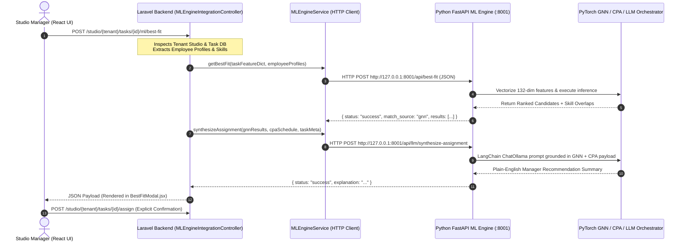
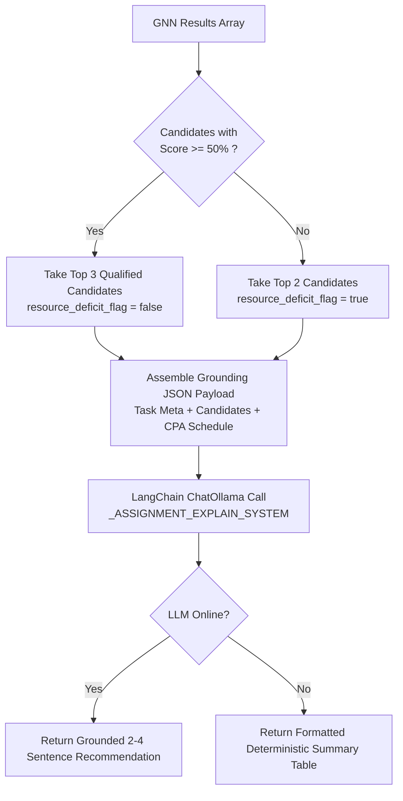

# StudioSprint AI Workspace & Match Fit Architecture

This document provides a comprehensive technical walkthrough of the **StudioSprint AI Workspace**, detailing end-to-end data travel, Language Model (LLM) orchestration, structured semantic parsing, response synthesis, and the complete computational lifecycle of the **Match Fit function**.

---

## Table of Contents
1. [Architectural Philosophy: Decision-Support vs. Directive](#1-architectural-philosophy-decision-support-vs-directive)
2. [End-to-End Data Travel](#2-end-to-end-data-travel)
3. [LLMs & AI Models Used](#3-llms--ai-models-used)
4. [Semantic Intent Parsing & Validation](#4-semantic-intent-parsing--validation)
5. [Explanation & Response Synthesis](#5-explanation--response-synthesis)
6. [Deep-Dive: Complete Match Fit Function Lifecycle](#6-deep-dive-complete-match-fit-function-lifecycle)

---

## 1. Architectural Philosophy: Decision-Support vs. Directive

StudioSprint follows a strict **Separation of Concerns** between **probabilistic natural language processing** and **deterministic graph/numerical reasoning**:

*   **LLM Orchestration Layer (LangChain / Ollama)**: Strictly responsible for **parsing unstructured human intent** (e.g., project descriptions, natural language queries) into validated JSON structures and **synthesizing human-readable explanations** from numerical engine outputs.
*   **Numerical & Graph Computation Layer (PyTorch Geometric / CPA Engine)**: Strictly responsible for all quantitative calculations, including **Match Fit probabilities ($0.00 \to 1.00$)**, developer skill overlaps, Critical Path Algorithm (CPA) schedules (`ES`, `EF`, `LS`, `LF`, `total_float`), and hard deadline validations.

> [!IMPORTANT]
> **Strict Architectural Constraint:** The LLM **NEVER** computes durations, task dependencies, match scores, or schedule dates directly. All numeric and graph calculations are generated by the GNN and CPA modules and passed into the LLM as immutable grounding context.

---

## 2. End-to-End Data Travel

When an engineering manager interacts with the AI Workspace (such as triggering **Best Fit Candidate Recommendation** or **Sprint Decomposition**), data flows across four decoupled layers:



### Layer 1: Frontend React / Inertia UI (`resources/js/Components/ML/`)
*   Components such as `BestFitModal.jsx` and `AISprintDecompositionModal.jsx` initiate user actions via asynchronous Axios requests.
*   During processing, the UI presents interactive visual feedback (e.g., `GNNLoadingView`) showing vectorization, inference, and synthesis progression.
*   All AI suggestions remain **editable previews** until explicitly confirmed and saved by the manager.

### Layer 2: Laravel Tenancy Application (`app/Http/Controllers/MLEngineIntegrationController.php`)
*   Path-based tenancy (`/studio/{tenant}/*`) resolves the tenant database connection.
*   The controller fetches the target `Task` and aggregates `EmployeeProfile` payloads from `Studio::users`, extracting:
    *   User display names, roles/positions, and total experience years.
    *   Explicit 1–5 skill proficiency ratings (`globalProfile->skills`).
    *   Macro domain tags (`microDomains`).
*   It formats the data into structured dictionaries and delegates communication to `MLEngineService.php`.

### Layer 3: Laravel ML Engine HTTP Bridge (`app/Services/MLEngineService.php`)
*   Communicates with the Python microservice over HTTP (`http://127.0.0.1:8001`).
*   Implements timeout management (`timeout(120)` to `timeout(600)`) to accommodate heavy inference tasks and logs connectivity errors with fallback responses.

### Layer 4: Python FastAPI ML Engine (`ml-engine/main.py`)
*   Validates incoming payloads using Pydantic schemas (`TaskInput`, `EmployeeProfile`, `SynthesizeAssignmentRequest`).
*   Routes data to specialized domain engines:
    *   `/api/best-fit` $\rightarrow$ `orchestration.gnn.gnn_rank_employees`
    *   `/api/llm/synthesize-assignment` $\rightarrow$ `orchestration.response_synthesizer.synthesize_assignment_explanation`
    *   `/api/llm/decompose-project` $\rightarrow$ `orchestration.intent_parser.decompose_project_into_tasks`
    *   `/api/schedule/compute` $\rightarrow$ `orchestration.cpa.CPAEngine`

---

## 3. LLMs & AI Models Used

The AI Workspace utilizes a hybrid suite of deep learning models and local language models:

| Component | Model / Technology | Configuration & Purpose |
| :--- | :--- | :--- |
| **Local LLM Engine** | **Ollama** via LangChain (`ChatOllama`) | Runs locally via `OLLAMA_BASE_URL=http://127.0.0.1:11434`. Completely air-gapped; no external API keys required. |
| **Primary LLM Model** | `llama3.1:8b` (default) / `llama3.2:3b` | Configured via `OLLAMA_MODEL`. Optimized for JSON schema adherence and structured extraction. |
| **LLM Temperature** | `temperature = 0.2` | Low temperature ensures deterministic extraction and prevents hallucinated task details or arbitrary dates. |
| **Match Fit Scorer** | **Heterogeneous GNN** (PyTorch Geometric) | Bipartite developer-task graph model (`models/gnn_model.pt`) with a Neural Link Prediction head predicting completion probabilities. |
| **Cold-Start Baseline** | **Text-Embedding Cosine Similarity** | 384-dimensional dense semantic embedding ranking used when a studio has insufficient historical data for GNN inference. |

---

## 4. Semantic Intent Parsing & Validation

When a manager submits a free-text project or task description, the system parses unstructured text into validated JSON objects via `ml-engine/orchestration/intent_parser.py`.

### 1. Parsing Process
1.  **Prompt Engineering**: System instructions (`_TASK_EXTRACTION_SYSTEM` and `_SPRINT_DECOMPOSE_SYSTEM`) constrain the LLM to output pure JSON matching strict Pydantic schemas.
2.  **Canonical Engineering Skill Alignment**: The LLM is strictly instructed to map required skills to canonical engineering tags (e.g., `React`, `TypeScript`, `FastAPI`, `PostgreSQL`, `Docker`, `Kubernetes`, `PyTorch`) rather than generic descriptors.
3.  **Sanitization**: `_extract_json_from_response()` automatically strips Markdown code fences (````json ... ````).
4.  **Resilience & Graceful Degradation**: If output parsing fails, the engine retries up to 2 times before falling back to `_stub_task_parse()` so managers never face unhandled application exceptions.

### 2. Pydantic Output Schema & Automatic Guardrails
Every parsed task must pass Pydantic validation through `TaskParseResult`:

```python
class TaskParseResult(BaseModel):
    title: str = Field(description="Short task title (max 80 chars)")
    objective: str
    task_classification: str  # Validated: Feature | Bug Fix | Research | DevOps | Testing | Documentation
    required_position: Optional[str]
    task_difficulty: str      # Validated: Easy | Medium | Hard
    priority: str             # Validated: Low | Medium | High | Critical
    minimum_experience_years: float
    estimated_hours: float
    required_skills: List[SkillRequirement]
    macro_domains: List[str]
```

*   **Atomic Task Guardrail (`keep_tasks_atomic`)**: A field validator automatically clamps `estimated_hours` to a maximum of **40.0 hours** (`min(float(v), 40.0)`), ensuring AI-generated tasks remain atomic and scheduleable within sprint boundaries.

---

## 5. Explanation & Response Synthesis

Once deterministic numerical algorithms compute fit scores or critical path schedules, `ml-engine/orchestration/response_synthesizer.py` translates those metrics into clear, professional natural language.

### 1. Assignment Synthesis (`synthesize_assignment_explanation`)
The synthesizer receives the top candidates from the GNN engine along with optional CPA schedule constraints.



#### Grounding & Capacity Warnings
*   **Qualified Fit (`resource_deficit_flag = false`)**: If candidates score $\ge 50\%$, the LLM explains *why* the recommended developer is ideal by referencing explicit skill overlaps (e.g., *"Recommended due to strong overlap in React and REST APIs"*).
*   **Resource Deficit Alert (`resource_deficit_flag = true`)**: If all candidates score $< 50\%$, the prompt instructs the LLM **not** to recommend them confidently. Instead, it issues a **Capacity Warning** explaining the gap and suggesting actionable remediation (e.g., upskilling, deadline extension, or external allocation).

### 2. Risk Detection & Project Chat Synthesis
*   **Risk Scans (`synthesize_risk_alert`)**: Receives deterministic risk vectors (`overdue_tasks`, `overloaded_employees`, `conflicts`) and writes concise, actionable alerts without speculating beyond the data.
*   **Project Assistant Chat (`chat_with_project_data`)**: Grounded in live database context (`project`, `tasks`, `stats`, `assignments`). If asked about unlisted data, the assistant explicitly states what is unavailable rather than fabricating names or completion dates.

---

## 6. Deep-Dive: Complete Match Fit Function Lifecycle

The **Match Fit function** computes compatibility between incoming tasks and studio developers. Below is the step-by-step technical lifecycle from frontend invocation to returned recommendation.

### Step 1: Controller Payload Preparation (`MLEngineIntegrationController::bestFit`)
When `POST /studio/{tenant}/tasks/{task}/ml/best-fit` is invoked:
1.  Loads the target `Task` and converts it into an ML dictionary via `$task->toGNNFeatureDict()`.
2.  Iterates through all studio `User` models, building an `employee_profiles` list with normalized skill proficiency levels ($1 \to 5$) and macro domain tags.
3.  Sends the composite payload to `http://127.0.0.1:8001/api/best-fit`.

### Step 2: Input Normalization & 132-Dimensional Vectorization (`orchestration/gnn.py`)
Within Python, `gnn_rank_employees()` preprocesses both the task and developer profiles into exact numerical tensors required by the GNN (`DeveloperDataLoader`):

1.  **Required Skills Alignment**: Transforms incoming task skills into a standardized dictionary aligned against 96 canonical skill columns (`skill_cols`).
2.  **Developer Node Matrix (`X_dev`) Construction**: Each developer is encoded into a **132-dimensional feature vector**:
    *   **23 dimensions**: One-hot encoding against `POSITIONS_SCHEMA` (e.g., Backend Developer, UI/UX Designer).
    *   **8 dimensions**: Multi-hot encoding against `MACRO_DOMAIN_NAMES` (e.g., Web & API Development, Game Frontend).
    *   **1 dimension**: Availability status bit (`1.0` for available).
    *   **1 dimension**: Normalized experience years (`exp / 20.0`).
    *   **3 dimensions**: Operational capacity indicators (`velocity=1.0`, `compliance=0.9`, `workload=0.2`).
    *   **96 dimensions**: Normalized skill proficiencies (`level / 5.0`).
3.  **Task Node Matrix (`X_task`) Construction**: Encodes the incoming task requirements into a matching 132-dimensional tensor.

### Step 3: PyTorch Geometric GNN Inference
The tensors (`X_dev` and `X_task`) are passed into the pre-trained neural link prediction model (`load_gnn_model`):
*   Computes the compatibility probability $P(\text{completion}) \in [0.00, 1.00]$ for every developer against the task.

### Step 4: Quantitative Skill Overlap Calculation
To provide inspectable transparency, the engine computes explicit mathematical skill intersection alongside the GNN probability score:

$$\text{Skill Overlap Ratio} = \frac{\sum \min(\mathbf{s}_{\text{dev}}, \mathbf{s}_{\text{task}})}{\sum \mathbf{s}_{\text{task}} + \epsilon}$$

It also extracts the exact human-readable canonical skill names where both the developer and task have non-zero weights (`overlapping_skill_names`).

### Step 5: Recommendation Synthesis & Frontend Rendering
1.  The Python engine formats the ranked candidate list:
    ```json
    {
      "user_id": 102,
      "display_name": "Alex Mercer",
      "position": "Senior Backend Developer",
      "match_fit_score": 0.94,
      "match_source": "gnn",
      "skill_overlap": ["Laravel", "PostgreSQL", "Docker"],
      "operational_capacity": "Available"
    }
    ```
2.  Laravel calls `synthesizeAssignment()` to append the natural language summary (`explanation`).
3.  In `BestFitModal.jsx`:
    *   Each candidate is rendered with a dynamic `ScoreBar` (`>=75%` Emerald, `>=50%` Amber, `<50%` Rose).
    *   The manager reviews the synthesized AI Recommendation and clicks **Assign** (`POST /studio/{tenant}/tasks/{task}/assign`), which atomically records the assignment in `assignments` and updates `task.assigned_user_id`.
