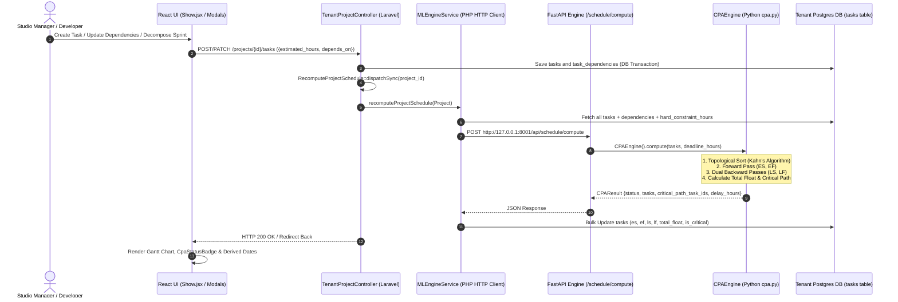

# Critical Path Analysis (CPA) Orchestration Engine

**Critical Path Analysis (CPA)** is a foundational scheduling, bottleneck detection, and workforce orchestration engine built into the **StudioSprint SaaS** platform. It provides dynamic, multi-tenant development studios with mathematical certainty regarding project timelines, task dependencies, delivery risks, and resource constraints.

---

## 1. Executive Summary & Purpose

In traditional project management tools, tasks are given rigid, hardcoded start and due dates (`start_date`, `due_date`). In fast-paced software studios and AI-assisted engineering sprints, rigid dates break down instantly:
- If an upstream task is delayed by two days, every downstream task's absolute database date must be manually updated.
- Project managers lack visibility into which tasks actually dictate the project completion date versus which tasks have comfortable breathing room (slack).
- Double-booking engineers across overlapping high-priority tasks goes undetected until deadlines are missed.

### The StudioSprint Solution
StudioSprint replaces rigid date entry with an **Elastic, Working-Hours Network Engine**. 
1. **Relative Working Hours (Backend/ML):** Tasks are modeled as a Directed Acyclic Graph (DAG) with durations (`estimated_hours`) and dependency edges (`depends_on`). The ML Engine calculates exact relative offsets—Earliest Start (`ES`), Earliest Finish (`EF`), Latest Start (`LS`), Latest Finish (`LF`), and Total Float (`total_float`)—measured in business working hours.
2. **Dynamic Calendar Derivation (Frontend/UI):** The frontend dynamically overlays those relative working hours onto the project's real-world calendar anchors (`start_date`, `target_end_date`), skipping weekends (`Saturday/Sunday`) to render exact target dates on Gantt charts, Kanban cards, and schedule boards.

---

## 2. Core Capabilities

| Capability | Description | Business & Engineering Impact |
| :--- | :--- | :--- |
| **Critical Path Identification** | Automatically calculates the topological longest path of dependent tasks through the project graph (`is_critical = true`). | Highlights exact tasks where **zero delay can be tolerated**. If any critical task slips, the entire project completion date delays. |
| **Negative Float & Breach Alerts** | Computes how much breathing room each task has before violating the project's external deadline (`target_end_date`) or task hard constraints (`hard_constraint_date`). | When `total_float < 0` (e.g., `-8.0 hours`), the UI immediately flags **Schedule Breached** with pulsing visual alerts. |
| **Resource Double-Booking Guardrails** | Validates proposed engineer assignments against critical path constraints (`/api/schedule/validate-assignments`). | Prevents assigning the same developer to multiple overlapping critical tasks during the same time window. |
| **Instant Synchronous Recalculation** | Executes forward and backward graph propagation algorithms in ~15ms whenever tasks or dependencies change. | Zero manual schedule maintenance. Adding a dependency or changing an estimate immediately updates the timeline across all views. |
| **AI Sprint Chaining** | Integrates with the LLM Sprint Decomposition pipeline (`/api/llm/decompose-project`). | When AI breaks down a complex goal into 10+ tasks, it automatically generates `suggested_depends_on` chains, making the sprint CPA-ready immediately. |

---

## 3. System Architecture & Data Flow

The CPA engine operates across three synchronized layers: the **Laravel Tenant Backend**, the **Python FastAPI Machine Learning Engine**, and the **React (Inertia.js) Frontend**.

### 3.1 The Mathematical Engine (`CPAEngine` in `cpa.py`)

All computations are pure functions executing in stateless memory:

#### 1. Topological Sorting & Cycle Detection
Uses **Kahn’s Algorithm** to sort tasks topologically based on `depends_on` edges. If a circular dependency is detected (e.g., Task A $\rightarrow$ Task B $\rightarrow$ Task A), the engine raises a validation error (`Cycle detected in task dependencies`), preventing infinite loops.

#### 2. Forward Pass (Earliest Dates)
Calculates the earliest time each task can start (`ES`) and finish (`EF`) from project kickoff (`0.0` hours):
$$\text{ES}_i = \begin{cases} 0.0 & \text{if task has no predecessors} \\ \max(\text{EF}_{\text{predecessors}}) & \text{if task has predecessors} \end{cases}$$
$$\text{EF}_i = \text{ES}_i + \text{duration}_i$$
The overall computed project completion time is $\text{ProjectFinish} = \max(\text{EF}_i)$.

#### 3. Dual Backward Passes (Latest Dates & Float)
To guarantee accurate reporting both when a project has slack and when it breaches deadlines, the engine executes two synchronized backward passes:
- **Topological Graph Pass:** Anchored to $\text{ProjectFinish}$. Calculates intrinsic network float ($\text{TF}_{\text{graph}} = \text{LS}_{\text{graph}} - \text{ES}$). Any task where $|\text{TF}_{\text{graph}}| < 10^{-5}$ is flagged as **intrinsically on the Critical Path** (`is_critical = true`).
- **Deadline Anchor Pass:** Anchored to the external target deadline ($\text{deadline\_hours}$) and bounded by individual task hard constraints ($\text{hard\_constraint\_hours}$). Calculates external float:
  $$\text{LF}_i = \min\left( \min(\text{LS}_{\text{successors}}), \, \text{HardConstraint}_i, \, \text{DeadlineAnchor} \right)$$
  $$\text{LS}_i = \text{LF}_i - \text{duration}_i$$
  $$\text{TotalFloat}_i = \text{LS}_i - \text{ES}_i$$

#### 4. Critical Status Determination
A task is marked `is_critical = true` if:
1. It is part of the longest chain through the network ($\text{TF}_{\text{graph}} == 0.0$), **OR**
2. Its external float has breached zero ($\text{TotalFloat}_i \le 0.0$).

---

## 4. Working Hours vs. Calendar Days

To prevent weekend distortions, the backend computes strictly in **Business Working Hours** based on a standard **8.0 working hours per day** (`WORK_HOURS_PER_DAY = 8.0`).

### Dynamic Frontend Calendar Mapping (`deriveCalendarDate`)
When the React UI displays a task on the Gantt chart or table, it converts relative hours into exact calendar dates using the helper function `deriveCalendarDate(startDateStr, hoursOffset)`:
1. Converts `ES` and `EF` into working days offset (`daysOffset = floor(hoursOffset / 8)`).
2. Iterates forward from `project.start_date`.
3. Skips Saturdays (Day `6`) and Sundays (Day `0`), counting only Monday–Friday (`1–5`).
4. Returns the exact formatted calendar date (`MMM D, YYYY` or `YYYY-MM-DD`).

---

## 5. How to Use CPA in StudioSprint

### Step 1: Set Project Anchors
When creating or editing a project (`Settings` tab or `CreateProjectModal`):
- **Start Date (`start_date`):** The kickoff date from which `ES = 0.0` is measured.
- **Target Deadline (`target_end_date`):** The external client or release deadline. Setting this enables the engine to calculate exact available slack or negative float delays.

### Step 2: Define Tasks & Dependencies (`depends_on`)
When creating tasks manually or editing them via `ManualTaskModal`:
- Set the **Estimated Hours (`estimated_hours`)**.
- In the **Predecessors (Depends On)** multi-select dropdown, select any tasks that must be completed *before* this task can begin.
- *Alternatively:* When using **Sprint Decomposition (`/decompose-project`)**, the AI automatically generates dependency chains for all recommended tasks.

### Step 3: (Optional) Pin Hard Constraints (`hard_constraint_date`)
If a specific task must be completed by a strict intermediate date (e.g., an external security audit or client demo milestone before the end of the project):
- Open `ManualTaskModal` (`Edit Task`).
- Set the **Hard Constraint Date (`hard_constraint_date`)**.
- If the task's earliest possible completion (`EF`) exceeds this date, the system immediately flags `total_float < 0` across the entire upstream dependency chain.

### Step 4: Monitor & Act on CPA Insights across UI Views

#### 1. Gantt Timeline View (`Project -> Timeline Tab`)
- **Visual Task Bars:** Positioned horizontally across dates based on `ES` and `EF`.
- **Dependency Connecting Arrows:** SVG curves illustrating predecessor $\rightarrow$ successor linkages.
- **Amber Flame Icons:** Mark critical path tasks (`is_critical = true`) that require top-priority developer allocation.
- **Pulsing Rose Bars:** Highlight tasks suffering from negative float (`total_float < 0`), immediately showing which tasks are breaching schedule anchors.

#### 2. Kanban Board & Spreadsheet Views (`Project -> Kanban / Spreadsheet Tabs`)
Every card and row includes the `CpaStatusBadge`:
- Schedule Breached (-X.Xh float): Task completion is pushed past its target or constraint. Requires immediate re-estimation, scope reduction, or adding developers.
- Critical Path (0h float): Task is on track but has zero slack. Must not slip.
- On Track (+X.Xh float): Task has comfortable breathing room and can absorb minor delays without impacting the project release date.

#### 3. Global Studio Schedule (`Dashboard -> Schedule Navigation`)
- Multi-project unified view (`Schedule/Index.jsx` & `DayPanel.jsx`).
- Groups tasks by their derived target finish date (`EF`) or fixed deadline across all active studio projects, allowing managers to balance developer workload across the entire tenant workspace.

---

## 6. API & Database Reference Table

### Database Schema (`tasks` table)
| Column Name | Type | Description |
| :--- | :--- | :--- |
| `es` | `decimal(8,2)` | Earliest Start (in working hours offset from project start). |
| `ef` | `decimal(8,2)` | Earliest Finish (`es + estimated_hours`). |
| `ls` | `decimal(8,2)` | Latest Start (`lf - estimated_hours`). |
| `lf` | `decimal(8,2)` | Latest Finish (constrained by successors or deadline anchor). |
| `total_float` | `decimal(8,2)` | Slack time (`ls - es`). Negative values indicate schedule breaches. |
| `is_critical` | `boolean` | `true` if task is on the longest path or `total_float <= 0`. |
| `hard_constraint_date` | `date` (nullable) | Optional fixed milestone date pinning `LF` for this specific task. |
| `schedule_computed_at` | `timestamp` | Timestamp of the most recent CPA calculation pass. |

### API Endpoints
| HTTP Method & Path | Controller / Service | Purpose |
| :--- | :--- | :--- |
| `POST /api/schedule/compute` | FastAPI `main.py` $\rightarrow$ `cpa.py` | Accepts task DAG + `deadline_hours`; returns full `es`, `ef`, `ls`, `lf`, `total_float`, and `is_critical` mapping. |
| `POST /api/schedule/validate-assignments` | FastAPI `main.py` $\rightarrow$ `cpa.py` | Validates proposed assignments against critical path ordering and double-booking rules. |
| `GET /tenant/projects/{project}` | `TenantProjectController@show` | Returns project with loaded `tasks` containing all precomputed CPA fields and dependency IDs. |
| `GET /tenant/schedule` | `TenantScheduleController@index` | Returns global studio-wide active tasks grouped by derived finish dates and CPA statuses. |
