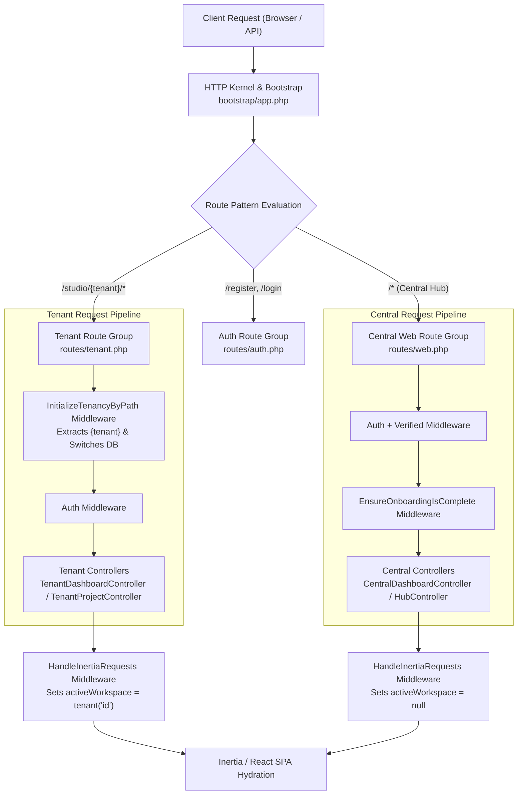
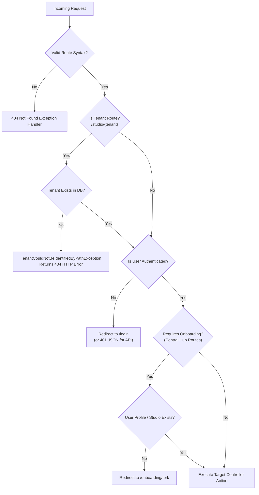

# Indie Studio SaaS: Routing Architecture & Lifecycle Guide

This document provides a comprehensive technical reference for the **Indie Studio SaaS** routing architecture. The application implements a hybrid **Central & Path-Based Multi-Tenant Routing** system built on **Laravel 11**, **Stancl/Tenancy**, and **Inertia.js (React)**.

---

## 1. Executive Summary

Indie Studio SaaS uses a **hybrid routing architecture** that separates **Central Hub operations** (onboarding, user profiles, cross-studio hub navigation) from **Tenant Studio workspaces** (studio dashboards, game projects) without requiring wildcard DNS or complex subdomain proxy configurations.

### Key Architectural Characteristics
* **Path-Based Multi-Tenancy (`/studio/{tenant}`)**: Studio workspaces are isolated under explicit URL path prefixes (`/studio/{tenant}/...`). The tenancy engine dynamically switches the application database and storage context based on the `{tenant}` path parameter.
* **Central Hub Application (`/`, `/dashboard`, `/onboarding`)**: Central routes handle non-tenant workflows, developer onboarding pipelines, studio creation, and profile management.
* **Unified SPA Hydration via Inertia.js**: Both central and tenant routes serve dynamic React pages hydrated with shared global props (`auth.user`, `activeWorkspace`) so frontend components automatically adapt their layout and navigation to the active context.



---

## 2. Step-by-Step Flow

When an HTTP request travels from client origin to controller response, it passes through a strictly prioritized lifecycle:

### Phase 1: Request Entry & Middleware Prioritization
1. **HTTP Entry Point**: All requests enter through `public/index.php` into the Laravel HTTP Kernel configured in [bootstrap/app.php](file:///e:/PROGRAMMING/Thesis/Project/indie-studio-saas/bootstrap/app.php).
2. **Tenancy Middleware Elevation**: During application boot, [TenancyServiceProvider::makeTenancyMiddlewareHighestPriority()](file:///e:/PROGRAMMING/Thesis/Project/indie-studio-saas/app/Providers/TenancyServiceProvider.php#L131-L147) prepends `InitializeTenancyByPath` and `PreventAccessFromCentralDomains` to the top of Laravel's HTTP Kernel middleware stack.

### Phase 2: Route Matching & Context Initialization
1. **Central vs. Tenant Route Resolution**:
   * If the URL path matches `/studio/{tenant}/*` (e.g., `/studio/my-game-studio/projects`):
     * The `InitializeTenancyByPath::class` middleware extracts the `{tenant}` parameter.
     * The tenant model is resolved from the database; the application switches connection context and sets `tenant('id')`.
   * If the URL targets central endpoints (`/dashboard`, `/onboarding/fork`, `/profile`):
     * The request bypasses tenant initialization and executes against the central database context.

### Phase 3: Security & Onboarding Gating
1. **Authentication Verification**: Routes wrapped in the `auth` middleware ensure an authenticated session exists. Unauthenticated requests are redirected to `/login` ([routes/auth.php](file:///e:/PROGRAMMING/Thesis/Project/indie-studio-saas/routes/auth.php)).
2. **Onboarding Enforcement (`requires.onboarding`)**:
   * Protected central routes (`/dashboard`, `/hub/*`) execute [EnsureOnboardingIsComplete](file:///e:/PROGRAMMING/Thesis/Project/indie-studio-saas/app/Http/Middleware/EnsureOnboardingIsComplete.php#L16-L33).
   * If the user has not completed their global profile (`!$hasProfile`) and does not own any studio (`!$ownsStudio`), the request is intercepted and redirected to `/onboarding/fork`.

### Phase 4: Controller Execution & SPA Hydration
1. **Action Execution**: The matched controller processes business logic (e.g., retrieving projects for the active tenant studio).
2. **Inertia State Hydration**: Before returning the response, [HandleInertiaRequests::share()](file:///e:/PROGRAMMING/Thesis/Project/indie-studio-saas/app/Http/Middleware/HandleInertiaRequests.php#L30-L41) attaches global React properties:
   ```php
   return [
       ...parent::share($request),
       'auth' => ['user' => $request->user()],
       'activeWorkspace' => tenant('id'), // returns tenant UUID or null
   ];
   ```
3. **Frontend Rendering**: React views (such as [Index.jsx](file:///e:/PROGRAMMING/Thesis/Project/indie-studio-saas/resources/js/Pages/Tenant/Projects/Index.jsx) or [Sidebar.jsx](file:///e:/PROGRAMMING/Thesis/Project/indie-studio-saas/resources/js/Components/Sidebar.jsx)) use `activeWorkspace` to construct relative studio navigation links dynamically.

---

## 3. Key Components

### 3.1 Route Definition Files

| File Path | Scope | URI Pattern | Description |
| :--- | :--- | :--- | :--- |
| [routes/web.php](file:///e:/PROGRAMMING/Thesis/Project/indie-studio-saas/routes/web.php) | Central | `/`, `/dashboard`, `/onboarding/*`, `/hub/*` | Core central hub routes, studio creation/joining, profile management, and onboarding flows. |
| [routes/tenant.php](file:///e:/PROGRAMMING/Thesis/Project/indie-studio-saas/routes/tenant.php) | Tenant | `/studio/{tenant}/*` | Path-scoped tenant workspace routes including studio dashboards and project resource endpoints. |
| [routes/auth.php](file:///e:/PROGRAMMING/Thesis/Project/indie-studio-saas/routes/auth.php) | Central | `/login`, `/register`, `/verify-email` | Guest and authentication lifecycle routes. |

### 3.2 Service Providers & Bootstrappers

* **[app/Providers/TenancyServiceProvider.php](file:///e:/PROGRAMMING/Thesis/Project/indie-studio-saas/app/Providers/TenancyServiceProvider.php)**
  * Registers `routes/tenant.php` via `mapRoutes()`.
  * Elevates `InitializeTenancyByPath` and related middleware to highest execution priority.
  * Orchestrates background lifecycle pipelines (`TenantCreated`, `TenantDeleted`) for tenant provisioning.
* **[bootstrap/app.php](file:///e:/PROGRAMMING/Thesis/Project/indie-studio-saas/bootstrap/app.php)**
  * Configures the application routing map (`routes/web.php`, `routes/console.php`).
  * Registers middleware aliases (`'requires.onboarding' => EnsureOnboardingIsComplete::class`) and Inertia web middleware.

### 3.3 Core Middleware

* **`Stancl\Tenancy\Middleware\InitializeTenancyByPath`**: Intercepts requests targeting `/studio/{tenant}`, extracts the tenant identifier, and initializes database isolation.
* **[App\Http\Middleware\EnsureOnboardingIsComplete](file:///e:/PROGRAMMING/Thesis/Project/indie-studio-saas/app/Http/Middleware/EnsureOnboardingIsComplete.php)**: Prevents users from accessing central hub actions until they create a developer profile or join/create a studio.
* **[App\Http\Middleware\HandleInertiaRequests](file:///e:/PROGRAMMING/Thesis/Project/indie-studio-saas/app/Http/Middleware/HandleInertiaRequests.php)**: Bridges server-side tenant awareness (`tenant('id')`) to client-side React pages.

### 3.4 Controller Architecture

* **Central Controllers**:
  * `CentralDashboardController`: Aggregates the user's central hub view.
  * `HubController`: Handles cross-studio actions (`createStudio`, `joinStudio`, `generateInvite`).
  * `OnboardingController`: Manages onboarding step progressions (`fork`, `show`, `store`).
* **Tenant Controllers**:
  * `TenantDashboardController`: Renders workspace-specific analytics and overview.
  * `TenantProjectController`: Manages CRUD lifecycle for studio projects (`index`, `show`, `store`) inside the tenant context.

---

## 4. Edge Cases & Error Handling



### 4.1 Unidentified or Non-Existent Tenant Slug
* **Scenario**: A user requests `/studio/non-existent-studio/dashboard`.
* **Handling**: `InitializeTenancyByPath` attempts to query the `Tenant` model by path slug. When lookup fails, it throws `Stancl\Tenancy\Exceptions\TenantCouldNotBeIdentifiedByPathException`. Laravel's exception handler catches this exception and renders a standard **404 Not Found** HTTP response.

### 4.2 Incomplete Developer Onboarding Loop Prevention
* **Scenario**: A newly registered user attempts to navigate directly to `/dashboard` or trigger `/hub/studio`.
* **Handling**: [EnsureOnboardingIsComplete](file:///e:/PROGRAMMING/Thesis/Project/indie-studio-saas/app/Http/Middleware/EnsureOnboardingIsComplete.php#L27-L30) checks both `$user->globalProfile !== null` and `$user->ownedStudios()->exists()`. If both evaluate to false, the user is safely redirected to `/onboarding/fork`, preventing partial data creation or broken hub states.

### 4.3 Unauthenticated Access to Protected Tenant / Central Endpoints
* **Scenario**: An expired session or unauthenticated request attempts to access `/studio/{tenant}/projects` or `/profile`.
* **Handling**: The standard Laravel `auth` middleware intercepts the request before controller execution. For browser requests, it redirects to `route('login')`. For AJAX / Inertia requests, it issues a `409 Conflict` (Inertia external redirect) or `401 Unauthorized` response.

### 4.4 API Request Exception Content-Type Formatting
* **Scenario**: An exception occurs inside an API request (`api/*`).
* **Handling**: Configured explicitly in [bootstrap/app.php:L24-L28](file:///e:/PROGRAMMING/Thesis/Project/indie-studio-saas/bootstrap/app.php#L24-L28), Laravel forces JSON rendering for any error occurring under `api/*`:
  ```php
  $exceptions->shouldRenderJsonWhen(
      fn (Request $request) => $request->is('api/*'),
  );
  ```
  This guarantees API clients receive structured JSON error payloads instead of HTML stack traces.
